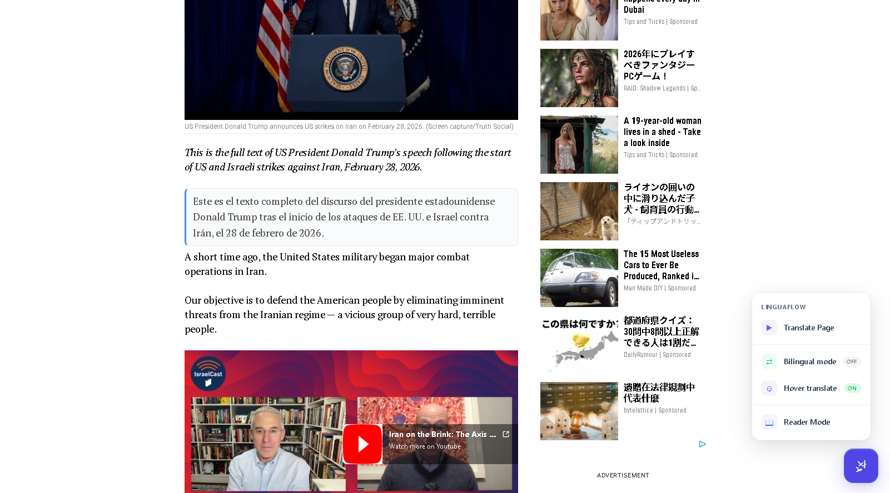
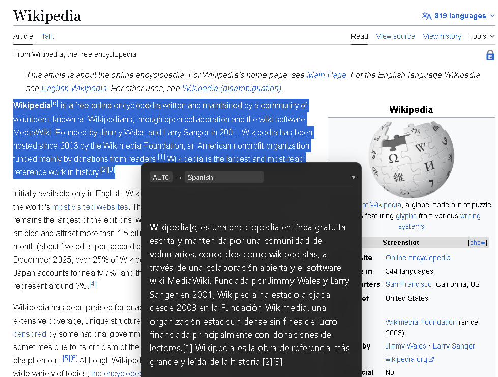
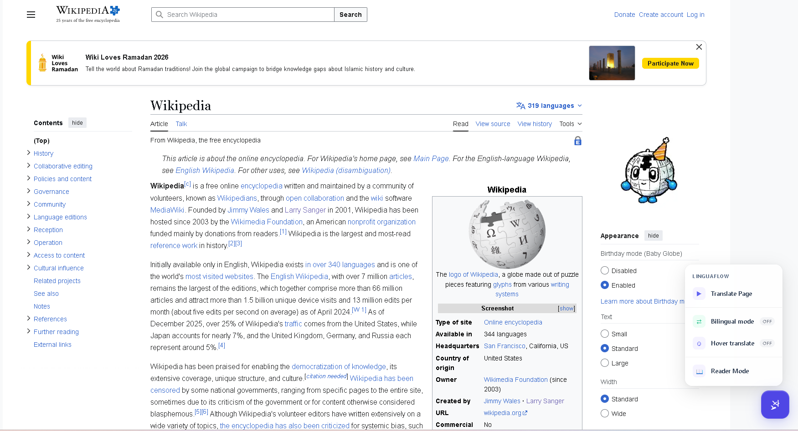
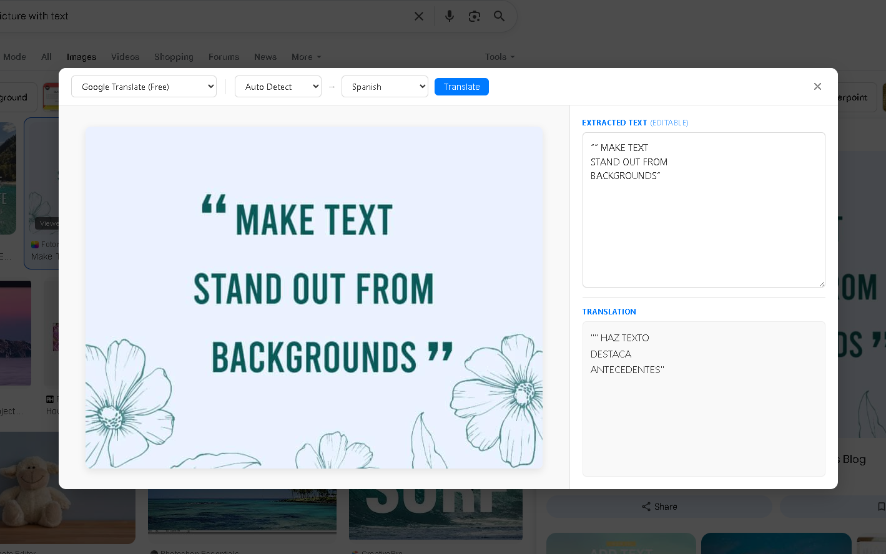
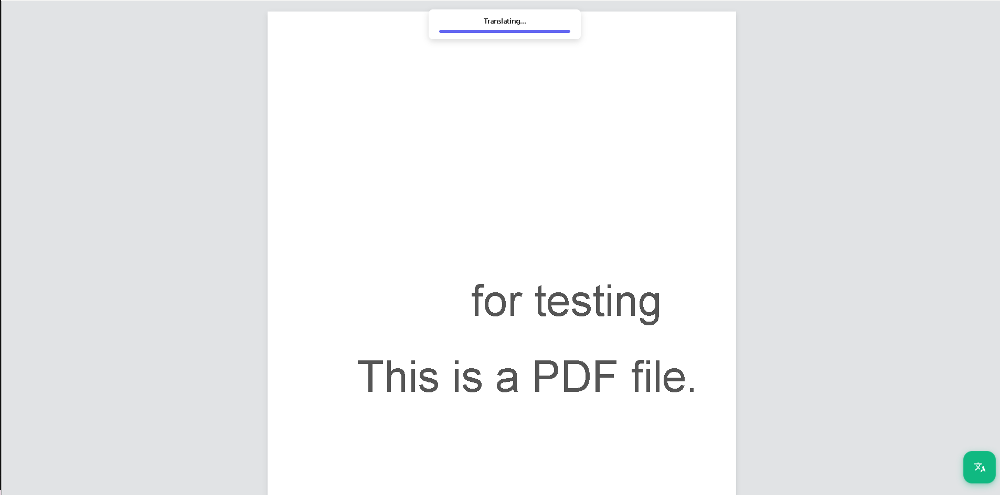
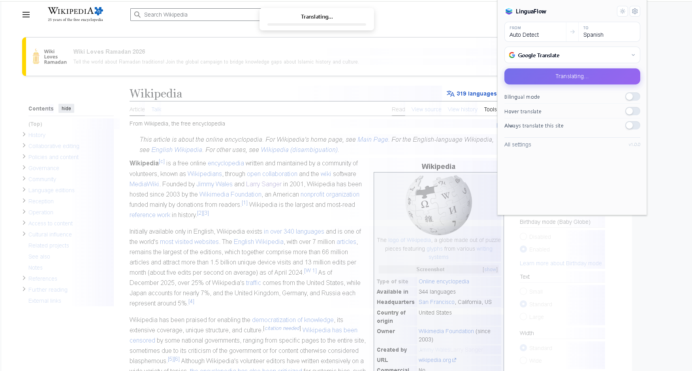

# LinguaFlow

**Open-source bilingual webpage translation Chrome extension.**

LinguaFlow translates webpages in-place, showing translations alongside the original text. It supports 10 translation engines (6 free, 4 paid), 29 languages, hover-to-translate mode, a fully localized UI in 11 languages, and a draggable floating action button for quick access.

Built with **React 19**, **TypeScript 5.7**, **Vite 6**, and **Chrome Manifest V3**.

---

## Features

- **Bilingual display** — translated text appears below each original paragraph with an accent border
  <br>
  
- **Replace mode** — swap original text with translation entirely
- **10 translation engines** — 6 free (no API key), 4 paid with API key validation
- **29 languages** — auto-detect source language, 28 target languages
- **Hover translate** — hover over any paragraph to translate it individually (300ms debounce); works independently alongside full-page translation
- **Floating Action Button (FAB)** — draggable on-page button with radial menu for Translate Page, Restore Original, Bilingual Mode, and Hover Translate. Configurable size (32–72px) and can be disabled in settings
- **Keyboard shortcut** — `Alt+A` to toggle translation
- **Context menu** — right-click "Translate Selection" or "Translate Page"
- **Smart content detection** — identifies main content areas (`<article>`, `<main>`, `[role="main"]`) with text-density scoring fallback; skips nav, footer, sidebar, ads, scripts
- **SPA support** — MutationObserver watches for dynamically added content
- **Translation cache** — IndexedDB-backed LRU cache (10,000 entries, 7-day TTL)
- **UI localization** — extension UI in 11 languages: English, Spanish, French, German, Portuguese, Italian, Chinese, Japanese, Korean, Russian, Arabic (auto-detects browser language)
- **Theme support** — light, dark, and system-auto themes
- **Customizable translation style** — font size, font family, text color, border color, italic toggle
- **Popup scaling** — adjust popup size for accessibility
- **Site lists** — auto-translate and never-translate domain lists
- **API key management** — per-engine configuration with validation
- **Onboarding** — first-time tooltip guiding new users
- **225 unit tests** across 22 test files

---

## Translation Engines

### Free (no API key required)

| Engine | Notes |
|--------|-------|
| **Google Translate** | Free `translate.googleapis.com` endpoint |
| **Bing Translate** | Microsoft Edge translation service |
| **Yandex Translate** | Yandex translation service |
| **Lingva** | Privacy-focused Google Translate proxy |
| **MyMemory** | Crowdsourced translation memory |
| **LibreTranslate** | Open source, self-hostable |

### Paid (API key required)

| Engine | Default Model | Notes |
|--------|---------------|-------|
| **DeepL** | — | High-quality neural translation; auto-detects free vs pro key |
| **OpenAI** | `gpt-4o-mini` | GPT-powered translation via Chat Completions API |
| **Claude** | `claude-sonnet-4-5-20250514` | Anthropic Messages API |
| **Microsoft Translator** | — | Azure Cognitive Services |

Configure API keys in **Settings > API Keys**. Each engine has a **Validate** button to test your key before use.

---

## Supported Languages

Auto Detect, English, Chinese (Simplified & Traditional), Japanese, Korean, French, German, Spanish, Portuguese, Russian, Arabic, Hindi, Italian, Dutch, Thai, Vietnamese, Indonesian, Turkish, Polish, Swedish, Danish, Finnish, Greek, Czech, Romanian, Hungarian, Ukrainian, Hebrew.

---

## Getting Started

### Prerequisites

- Node.js 18+
- npm 9+
- Chrome 116+ (Manifest V3 support)

### Install & Build

```bash
git clone <repo-url>
cd linguaflow
npm install
npm run build
```

1. Open `chrome://extensions` in Chrome
2. Enable **Developer mode** (top right)
3. Click **Load unpacked**
4. Select the `dist/` folder

### Development

```bash
npm run dev
```

Starts all three Vite watchers in parallel (popup/options, content script, background service worker). Changes rebuild automatically — reload the extension in Chrome to pick them up.

### Commands

| Command | Description |
|---------|-------------|
| `npm run dev` | Watch mode for all three bundles |
| `npm run build` | Production build to `dist/` |
| `npm run test` | Run 225 unit tests with Vitest |
| `npm run test:watch` | Run tests in watch mode |
| `npm run lint` | ESLint check |
| `npm run typecheck` | TypeScript type checking |
| `npm run clean` | Remove `dist/` directory |

---

## Usage

### Translate a page

1. Navigate to any webpage
2. Click the LinguaFlow icon in the toolbar (or press `Alt+A`)
3. Select your target language and translation engine
4. Click **Translate Page**
5. Translated text appears below each paragraph

### Hover mode

1. Toggle **Hover Translation** in the popup or FAB menu
2. Hover over any paragraph — it highlights and translates after a brief pause
3. Hover mode works independently: enable it alongside full-page translation, and only hovered paragraphs get individually translated while the rest remain stable



### Floating Action Button (FAB)

A draggable button on every page with quick actions:
- **Translate Page** / **Restore Original**
- **Bilingual Mode** toggle
- **Hover Translate** toggle



Drag it anywhere on the page. In Settings, you can disable the FAB or adjust its size (32–72px). The FAB menu translates when you change the UI language.

### Context menu & Images

Right-click on a page or image for:
- **Translate Selection** — translates only highlighted text
- **Translate Page** — translates the entire page
- **Inspect Image Text** — invokes built-in OCR to analyze and translate flat images



### PDF Rendering

Drop a local PDF or visit an online PDF to activate the split-view native renderer. LinguaFlow intercepts the file, preserves identical structural formatting, and allows parallel block translations natively over the canvas.



---

## Settings

Access settings via the gear icon in the popup. The sleek interfaces allow deep customization:
<br>


| Section | Options |
|---------|---------|
| **General** | Source language, target language, display mode (bilingual/replace) |
| **Engine** | Select active engine, filter by free/paid |
| **API Keys** | Per-engine key input with Validate button |
| **Translation Style** | Font size (70–120%), font family, text color, border color, italic |
| **Interface** | Theme (light/dark/system), UI language (11 locales), popup scale |
| **Floating Button** | Enable/disable FAB, adjust size (32–72px) |
| **Shortcuts** | `Alt+A` to toggle translation |
| **Data** | Cache stats and clear button |
| **Site Lists** | Auto-translate domains, never-translate domains |

---

## Project Structure

```
linguaflow/
├── public/
│   ├── manifest.json              # Chrome Manifest V3 configuration
│   └── icons/                     # Extension icons (16/32/48/128px + logo)
├── src/
│   ├── types/                     # TypeScript interfaces & enums
│   │   ├── translation.ts         # TranslationEngine enum, Request/Result types
│   │   ├── settings.ts            # UserSettings, TranslationStyle, UILocale
│   │   ├── messages.ts            # Discriminated union message types
│   │   └── dom.ts                 # TranslatableNode interface
│   ├── constants/
│   │   ├── languages.ts           # 29 languages with ISO codes
│   │   ├── engines.ts             # 10 engine definitions (name, color, requiresKey)
│   │   └── defaults.ts            # Default settings values
│   ├── shared/
│   │   ├── storage.ts             # Typed chrome.storage.local wrapper
│   │   ├── cache.ts               # IndexedDB cache (FNV-1a hash, LRU, 7-day TTL)
│   │   ├── message-bus.ts         # Typed message helpers
│   │   ├── i18n.ts                # 11-locale i18n system with flag emoji support
│   │   └── logger.ts              # Prefixed console logger
│   ├── engines/
│   │   ├── base-engine.ts         # Abstract base class
│   │   ├── google-translate.ts    # Free endpoint, no key
│   │   ├── bing-free-engine.ts    # Free Bing translation
│   │   ├── yandex-engine.ts       # Free Yandex translation
│   │   ├── lingva-engine.ts       # Privacy-focused proxy
│   │   ├── libre-engine.ts        # Open source engine
│   │   ├── mymemory-engine.ts     # Crowdsourced memory
│   │   ├── deepl-engine.ts        # DeepL API (free/pro auto-detect)
│   │   ├── openai-engine.ts       # GPT Chat Completions
│   │   ├── claude-engine.ts       # Anthropic Messages API
│   │   ├── microsoft-engine.ts    # Azure Cognitive Services
│   │   └── index.ts               # Engine factory
│   ├── background/
│   │   ├── index.ts               # Service worker entry
│   │   ├── message-handler.ts     # Message routing
│   │   ├── translation-service.ts # Batching, caching, engine dispatch
│   │   ├── context-menu.ts        # Right-click menu items
│   │   └── keyboard-shortcuts.ts  # Alt+A listener
│   ├── content/
│   │   ├── index.ts               # Content script orchestrator
│   │   ├── content.css            # Bilingual block styles, spinners
│   │   ├── dom-walker.ts          # TreeWalker for translatable nodes
│   │   ├── content-detector.ts    # Content area heuristics, exclusion filters
│   │   ├── translator-ui.ts       # Inject/remove bilingual blocks
│   │   ├── hover-handler.ts       # 300ms debounced hover translate
│   │   ├── floating-button.ts     # Draggable FAB with i18n labels
│   │   ├── onboarding.ts          # First-time tooltip
│   │   └── mutation-observer.ts   # SPA content change watcher
│   ├── popup/
│   │   ├── index.html             # Popup shell
│   │   ├── main.tsx               # React entry
│   │   ├── App.tsx                # Popup + in-app settings with slide transitions
│   │   ├── popup.css              # All popup styles
│   │   ├── components/            # TranslateToggle, LanguageSelector, EngineSelector, etc.
│   │   └── hooks/
│   │       ├── useSettings.ts     # Settings read/write hook
│   │       └── useTranslationState.ts  # Translation state hook
│   └── options/
│       ├── index.html
│       ├── main.tsx
│       ├── App.tsx                # Full options page with tabs
│       ├── options.css
│       └── components/            # ApiKeyForm, CacheManager, StylePreferences, etc.
├── tests/
│   ├── mocks/chrome.ts            # Chrome API mocks for Vitest
│   └── unit/                      # 225 tests across 22 files
│       ├── engines/               # Tests for all 10 engine implementations
│       ├── content/               # content-detector, dom-walker, hover-handler, translator-ui
│       ├── shared/                # storage, message-bus, i18n, logger
│       ├── constants/             # defaults, engines
│       └── background/            # translation-service
├── vite.config.ts                 # Popup + Options (React multi-page)
├── vite.content.config.ts         # Content script (IIFE)
├── vite.background.config.ts      # Service worker (ES module)
└── vitest.config.ts               # Test configuration (jsdom)
```

---

## Architecture

### Build System

Three separate Vite configurations produce independent bundles:

| Config | Entry | Format | Output |
|--------|-------|--------|--------|
| `vite.config.ts` | Popup + Options HTML | ES modules | `dist/popup/`, `dist/options/` |
| `vite.content.config.ts` | `src/content/index.ts` | IIFE | `dist/content/index.js` |
| `vite.background.config.ts` | `src/background/index.ts` | ES module | `dist/background/index.js` |

All three run in parallel during development via `concurrently`.

### Message Passing

Typed discriminated union messages flow between contexts:

```
┌──────────┐     TRANSLATE_REQUEST      ┌────────────┐
│  Content  │ ──────────────────────────>│ Background │
│  Script   │<────────────────────────── │  (Service  │
│           │    TranslationResult       │   Worker)  │
└──────────┘                             └────────────┘
      ^                                        ^
      │  TOGGLE_TRANSLATION                    │
      │  TRANSLATE_PAGE                        │
      │  SETTINGS_CHANGED                      │
      │                                        │
      └──────── Popup/Options ─────────────────┘
                 (React UI)
```

### DOM Walking

1. **Exclusion filter** — skips `<script>`, `<style>`, `<nav>`, ads, hidden elements, and the extension's own UI
2. **Translatable tags** — `P`, `H1`–`H6`, `LI`, `TD`, `TH`, `BLOCKQUOTE`, `FIGCAPTION`, `A`, `SPAN`, etc.
3. **Container fallback** — `DIV`, `SECTION`, `ARTICLE` translated only if they have direct text without translatable children
4. **Deduplication** — `data-immersive-translated` attribute prevents double-translation

### Translation Cache

- **Storage**: IndexedDB (`immersive-translate-cache`)
- **Key**: FNV-1a hash of `engine:sourceLang:targetLang:normalizedText`
- **Eviction**: LRU at 10,000 entries
- **TTL**: 7 days

### State Management

No external state library. `chrome.storage.local` is the single source of truth:

- `useSettings` hook reads on mount, subscribes to `chrome.storage.onChanged`
- `updateSettings` writes partial updates and broadcasts to all tabs
- Content script listens for `SETTINGS_CHANGED` to apply changes in real-time (theme, locale, FAB size/visibility, etc.)

---

## Permissions

| Permission | Reason |
|------------|--------|
| `activeTab` | Access the current tab's DOM for translation |
| `storage` | Persist settings and engine configurations |
| `contextMenus` | Right-click "Translate Selection/Page" menu items |
| `scripting` | Inject content scripts when needed |

### Host Permissions

API endpoints for each translation engine:

- `https://translate.googleapis.com/*`
- `https://api-free.deepl.com/*` / `https://api.deepl.com/*`
- `https://api.openai.com/*`
- `https://api.anthropic.com/*`
- `https://api.cognitive.microsofttranslator.com/*`

---

## Tech Stack

| Layer | Technology |
|-------|------------|
| UI Framework | React 19 |
| Language | TypeScript 5.7 |
| Build Tool | Vite 6 |
| Testing | Vitest 2 (225 tests, jsdom) |
| Extension | Chrome Manifest V3 |
| Cache | IndexedDB |
| Styling | Plain CSS |

---

## Contributing

Contributions are welcome! This is an open-source project. Feel free to open issues and pull requests.

## License

MIT
